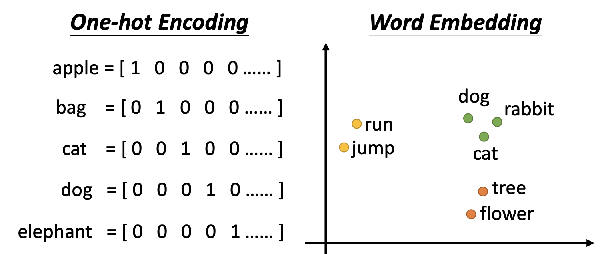
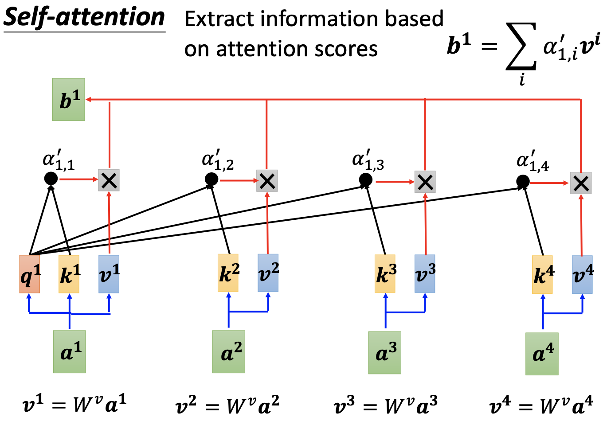
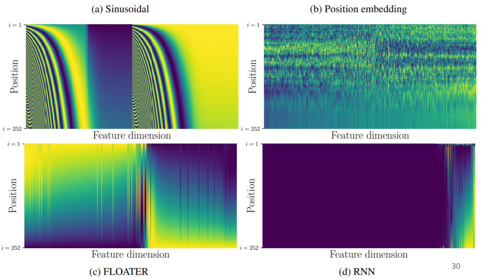
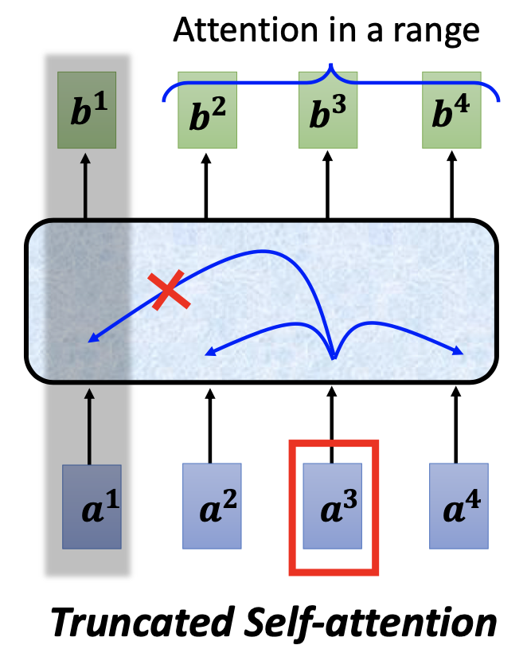

<h1 align = "center">self-attention</h1>

## 应用背景

普通CNN输入为一个向量，无法应对输入为多个向量的情况：

## 应用场景

### 输入

1. 词向量作为输入（2种词编码方式：one-hot Encoding和word Embedding）

   

2. 语音作为输入

   

3. 图作为输入

   

4. 分子结构作为输入

   

5. 等...

### 输出

1. N-N：词性标注、客户筛选（重点关注）
2. N-1：语义评价、分子性质分类
3. N-M：翻译

如下：

## Self-attention实现

### 要求

以输入输出N-N为例：取window包含N个输入，N个输入在互相关联（考虑上下文）后通过self-attention产生N个输出。

如下图transformer为例：

### self-attention具体实现

​																																													图1

​																																														图2

步骤如下：

1. 分别计算每个输入的query，即$$q^i=W^q*a^i$$​​​​​​，其中$$W^q$$​​​​​为$$a$$​到$$q$$​的映射矩阵，$$a^i$$​​​​为输入，$$q^i$$​​​​为query用以查询其与其他key之间的相关性；
2. 分别计算每个输入的key，即$$k^i=W^k*a^i$$​​​​，其中$$W^k$$​​​​为$$a$$​到$$k$$​的映射矩阵，$$a^i$$​​​​为输入，$$k^i$$​​​​​为key用以被查询query与其之间的相关性；
3. 分别计算各个query与各个key之间的相关性，即$$\alpha'_{i,j}=softmax(q^i*k^j)$$​​，其中$$\alpha'_{i,j}$$​​​​为归一化后的相关性，反应$$a^i$$​​与$$a^j$$​​之间的相关性（激活函数可任意选择，不限于softmax）；
4. 分别计算每个输入的value，即$$v^i=W^v*a^i$$​，其中$$W^v$$​为$$a$$​到$$v$$​的映射矩阵，$$a^i$$​为输入，$$v^i$$​为value用以表示输入向量；
5. 分别计算每个输出b，即$$b^i=\sum_j{\alpha'_{i,j}*v^j}$$​​，其中$$b^i$$表示输入$$a^i$$对应的输出。

注意：

* 由上述步骤知：输入$$a^i$$与输入$$a^j$$之间的相关性越大，$$\alpha_{i,j}$$越大，相对应的，$$b^i$$就接近$$v^j$$。

### self-attention矩阵实现

1. I到Q,K,V的矩阵实现：

2. K,Q到A/A’的矩阵实现：

3. V,A‘到O的矩阵实现：

## self-attention拓展

### Multi-head self-attention

优点：使用多个head，每个head关注的相关性不同，可以从多方面计算得到更好的相关性。

图示：

​																																														图3

​																																														图4

​																																														图5

说明：将q，k，v分别乘上2个矩阵，得到q1、q2，k1、k2，v1、v2，分别计算bi,1和bi,2，拼接乘以矩阵得到bi。

### Positional Encoding

目的：上述self-attention结构丢失位置信息，需要人为添加位置信息。

方法：在输入$$a^i$$上加上代表位置的$$e^i$$从而给出位置信息，如图：

* 每个位置有一个独一无二的位置向量（positional vector）$$e^i$$
* 可以为手工设定
* 可以从数据中学习得到

举例：

### self-attention与CNN

结论：

* CNN可以视为只关注小范围内的self-attention，CNN是简化的self-attention。

* self- attention可以视为关注范围可学习的CNN，self-attention是复杂化的CNN。
* self- attention在更多数据的情况下效果更佳，CNN在更少数据的情况下效果更佳。

### self-attention与RNN

结论：

* 当首尾输入需要相互考虑时，RNN需要一个一个传播下去，self- attention直接一个作为q，一个作为k，计算相关性，无需传播。
* RNN无法并行计算，self- attention可以并行计算。

## self-attention应用

1. 在语音上的应用：

   相关性矩阵的大小为输入向量个数的平方，但由于语音信号过长，计算量过大，因此语音处理时一般只关注小范围内的关系。

   

2. 在图像上的应用：

   一般将图像RGB3个通道的像素组成一个vector，长乘以宽为向量个数。

   

3. 在图上的应用：

   

4. 在GAN等其他方面的应用：

   

   

